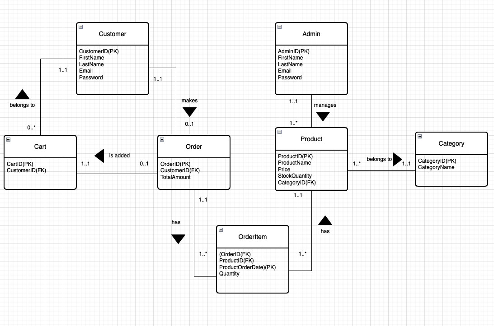

# Eshopperz

Eshopperz serves as the backend server for a cutting-edge ecommerce application, aiming to provide individuals with an outstanding and secure shopping experience through modern and efficient functionalities.

## Features

- **Customer Registration**: Users can sign up by providing their email and password.
- **Email Verification**: After registration, an email is sent to the user's address to verify its authenticity.
- **Login**: Post-verification, users can log in to the application and receive a JWT (JSON Web Token) for authentication purposes.
- **Product Management**: Eshopperz allows efficient management of products, including adding new items, updating details, and removing products when necessary. This feature ensures that the product catalog stays current and appealing.
- **Category Management**: Admin users can organize products into different categories, facilitating a well-structured and user-friendly shopping experience. This feature aids in efficient navigation and product discovery.
- **Shopping Cart**: Users can add products to their shopping cart, enabling them to review and manage their selected items before proceeding to checkout. The shopping cart enhances the overall shopping experience.
- **Order Placement**: Once users are satisfied with their selected items, they can securely place orders. Eshopperz handles the order creation process, ensuring accuracy and reliability.
- **Role-Based Authentication**: Eshopperz implements role-based authentication, ensuring that certain functionalities are accessible only to authorized users. Admins have specific privileges for managing products, categories, and user roles.
- **Security Measures**: The application incorporates robust security measures, such as JWT authentication, to protect user accounts and sensitive information. This ensures a secure and trustworthy environment for both users and administrators.
- **Database Management**: The application efficiently manages the database, ensuring data integrity and providing a reliable foundation for storing product, user, and order information.
- **Logger Integration for Error Handling**: This project utilizes the Serilog logging library for efficient event tracking and error recording. Logging plays a vital role in monitoring application behavior, identifying issues, and maintaining insights.

## Technology

- Version: ASP.NET Core 8.0
- DataBase: SQLite
- Cloud Platform Deployment: Microsoft Azure
- Version Control: Git/GitHub
- Workflow Pipeline: GitHub Actions-Workflow, Azure Web App Service
- Email Server: Gmail
- ORM Framework: Entity Framework Core
- Authentication and Authorization: Identity Framework
- Authentication for securing APIs: JWT Authentication
- Logger: Serilog is the chosen logging library for this project, providing a flexible and structured logging framework.

## Project Structure

The project is structured as follows:

- Controllers: Contains API controllers for different entities.
- Models: Defines the data models used in the - application.
- Logs: Manages the Serilog logging library for efficient event tracking and error recording.
- wwwroot: Contains deployment files.
- Migrations: Contains Migration files.

## Database Schema

The database schema includes entities such as Category, Cart, Customer, Order, OrderItem, Product, and user roles. Relationships between these entities are established through foreign keys.

## ERD

## Controllers

- CategoryController:
Manages CRUD operations for product categories.
Supports operations like retrieving all categories, creating new categories, updating existing categories, and deleting categories.
- CartsController:
Handles shopping cart-related operations.
Supports actions like retrieving carts, getting a specific cart, updating a cart, creating a new cart, and deleting a cart.
- CustomerController:
Manages customer-related operations.
Supports actions like retrieving customers, getting a specific customer, updating customer details, creating new customers, and deleting customers.
- OrderController:
Handles order-related operations.
Supports actions like retrieving orders, getting a specific order, updating order details, creating new orders, and deleting orders.
- OrderItemController:
Manages operations related to order items.
Supports actions like retrieving order items, getting a specific order item, updating order item details, creating new order items, and deleting order items.
- ProductController:
Manages product-related operations.
Supports actions like retrieving products, getting a specific product, updating product details, creating new products, and deleting products.
- RolesController:
Manages user roles and permissions.
Supports actions like retrieving roles, getting a specific role, creating new roles, updating role details, and deleting roles.
- AccountController:
Manages user account-related operations.
Supports actions like user registration, authentication, and password recovery.

## Security

The application implements role-based access control using ASP.NET Core Identity. The RolesController allows the creation, update, and deletion of user roles. Additionally, the [Authorize(Roles = "Administrator")] attribute is applied to controllers where administrator access is required.

## Getting Started

To get started with Eshopperz, follow these steps:

1. Clone the repository to your local machine.
2. Ensure you have the necessary environment set up, including any required databases or services.
3. Install the dependencies.
4. Set up your environment variables, including those needed for email services and JWT authentication.
5. Run the application.

## Maintenance

- Regularly update dependencies.
- Monitor logs for errors.
- Perform database backups before significant changes.

## Logging Overview

This project utilizes the Serilog logging library for efficient event tracking and error recording. Logging plays a vital role in monitoring application behavior, identifying issues, and maintaining insights.

- Configuration: Logging setup occurs during the application's configuration phase, specifying where log information should be stored or displayed.
- Log Levels: Serilog categorizes logs into levels like Error, Warning, Information, and Debug based on severity.
- Error Handling: Logging strategically captures exceptions and errors, aiding in debugging and issue resolution.
- Informational Logging: Significant events, such as role creation, updates, deletions, or user role assignments, are logged to track application state changes.
- Request Logging: In specific actions, the incoming request body is logged for auditing and understanding processed data.
- Exception Logging: Exceptions are logged with details, facilitating quick identification of errors and their origin.
- Structured Logging: Serilog supports structured logging, enhancing log event readability and filtering with key-value pairs.
- Exception Handling: Logging within try-catch blocks ensures caught exceptions are recorded, preventing unexpected application termination.
